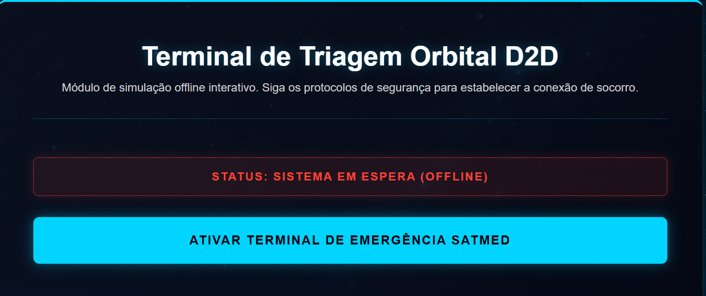
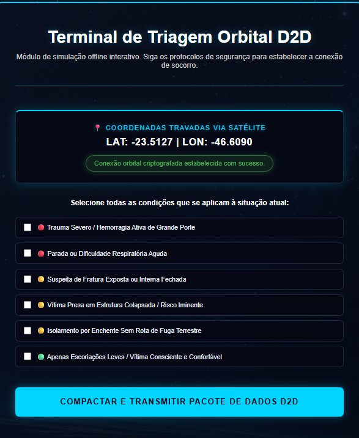
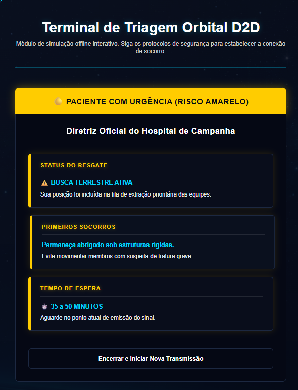
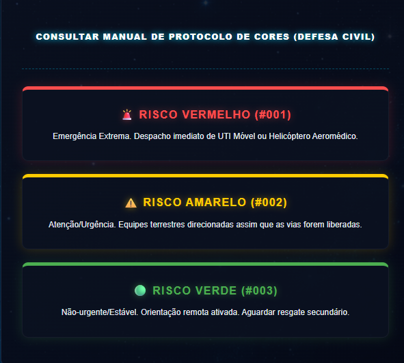
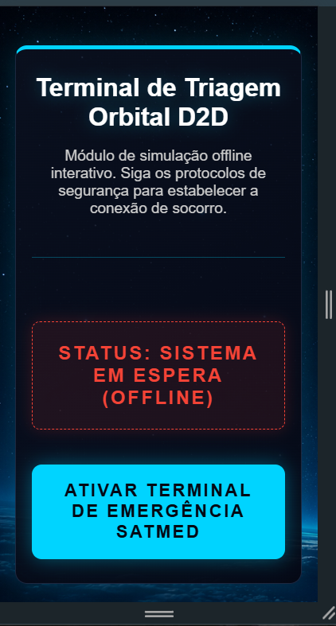

# Satmed - Triagem Espacial D2D

## 1. Título e Descrição

**Satmed**

O Satmed é um aplicativo de emergência e auto-triagem projetado para operar via conectividade satelital direta (Direct-to-Cell / D2D). Ele atua como uma ponte de comunicação de via dupla entre cidadãos isolados pela falha da infraestrutura terrestre e os centros médicos de resgate.

A plataforma permite que dados vitais e de localização sejam coletados offline no próprio smartphone da vítima, classificados automaticamente por nível de urgência e transmitidos para as autoridades em hospitais urbanos.

O sistema garante resgates rápidos para casos críticos e permite o retorno de orientações médicas remotas, independentemente do colapso das redes tradicionais (4G/5G).

---

## 2. Tecnologias Utilizadas

Este projeto foi desenvolvido utilizando exclusivamente tecnologias nativas da Web, sem o uso de frameworks externos, cumprindo os requisitos da disciplina de Front-End Design Engineering:

- **HTML5:** Estruturação semântica de todas as páginas.
- **CSS3:** Estilização, animações (`keyframes`), uso de Flexbox/Grid e responsividade (`@media queries`).
- **JavaScript (Vanilla):** Manipulação do DOM, simulação do terminal de triagem D2D, validação de formulários e interatividade.

---

## 3. Estrutura de Pastas

O projeto segue uma arquitetura modular e organizada:

```text
📦 Satmed
 ┣ 📂 assets/  # Imagens, ícones do projeto
 ┣ 📂 css/
 ┃ ┣ 📂 layout/
 ┃ ┣ 📂 paginas/
 ┃ ┣ 📂 responsividade/
 ┃ ┣ 📜 main.css
 ┃ ┗ 📜 style.css
 ┣ 📂 js/
 ┃ ┗ 📜 script.js
 ┣ 📂 paginas/
 ┃ ┣ 📜 contato.html
 ┃ ┣ 📜 faq.html
 ┃ ┣ 📜 integrantes.html
 ┃ ┣ 📜 simulador.html
 ┃ ┗ 📜 sobre.html
 ┣ 📜 index.html
 ┗ 📜 README.md
```

---

# Autores e Créditos

## Maria Eduarda Escandor (RM: 568216)

LinkedIn:  
https://www.linkedin.com/in/maria-eduarda-escandor-5b1587359/

GitHub:  
https://github.com/mariabatistaescandor-gif


## Erick Menezes (RM: 570325)

LinkedIn:  
https://www.linkedin.com/in/erick-menezes-b53009232/

GitHub:  
https://github.com/Erick488-maker


## Maria Eduarda Lopes de Lima (RM: 572425)

LinkedIn:  
https://www.linkedin.com/in/maria-eduarda-lopes-de-lima-1291b6289/

GitHub:  
https://github.com/mariaeduardaalima


## Nicolas Sousa (RM: 574141)

LinkedIn:  
https://www.linkedin.com/in/nicolas-sousaa/

GitHub:  
https://github.com/nicolaspk


---

# 5. Imagens e Ícones Relacionadas ao Projeto

## Terminal de Triagem (Simulador)








## Classificação de Risco




## Responsividade (Versão Mobile)




As imagens utilizadas no projeto (`triagem.png`, `triagem2.png`, `triagem3.png`, `cores.png` e `resp1.png`) estão localizadas na pasta `assets` e representam as telas, identidade visual e funcionamento da solução.

O logotipo e background utilizados no projeto remetem à comunicação via satélite e à temática da Economia Espacial.

---

# 6. Link do Repositório do GitHub

Acesse o código-fonte completo e o histórico de versionamento:

🔗 https://github.com/nicolaspk/Satmed

---

# 7. Contato

Para dúvidas técnicas, suporte ou informações sobre a infraestrutura da solução:

**E-mail de Suporte:**  
materiafiap@gmail.com

**Portal de Contato Interno:**  
Acesse a aba Contato na aplicação.